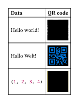

# typst-plugins

This repository contains my plugins for [typst](https://github.com/typst/typst).

## base64
A plugin for encoding and decoding base64 strings (based on [`rust-base64`](https://github.com/marshallpierce/rust-base64)). The plugin
comes with an `encode` and a `decode` method, where `encode` takes a string, an array, or a bytes object and returns a string, and `decode` takes a string and returns a bytes object. It can be used as follows:

```typ
#import "@local/base64:0.1.0"

#table(
  columns: 2,
  
  [*Decoded*],            [*Encoded*],
  [Hello world!],         raw(base64.encode("Hello world!")),
  raw("SGFsbG8gV2VsdCE"), str(base64.decode("SGFsbG8gV2VsdCE")),
  [#(1, 2, 3, 4)],        raw(base64.encode((1, 2, 3, 4))),
  raw("BAMCAQ"),          [#array(base64.decode("BAMCAQ"))],
)
```


## hash
A plugin that implements the following hashing algorithms (based on [`RustCrypto`](https://github.com/RustCrypto/hashes)'s crates):

- BLAKE2
- BLAKE2s
- MD5
- SHA-1
- SHA-224
- SHA-256
- SHA-384
- SHA-512
- SHA-3

It comes with a `hash` method that takes a hash algorithm and a string, array, or bytes object, and returns a bytes object. It also includes a `hex` method to allow displaying the hash in hexadecimal format. Each hash algorithm also has its own method that only takes the data to hash. It can be used as follows:

```typ
#import "@local/hash:0.1.0": hash, hex, md5, sha256, sha3

#table(
  columns: 2,
  
  [*Algorithm*], [*Hash*],
  [BLAKE2],      hex(hash("blake2", "Hello world!")),
  [BLAKE2s],     hex(hash("blake2s", "Hello world!")),
  [MD5],         hex(md5("Hello world!")),
  [SHA-1],       hex(hash("sha1", "Hello world!")),
  [SHA-224],     hex(hash("sha224", "Hello world!")),
  [SHA-256],     hex(sha256("Hello world!")),
  [SHA-384],     hex(hash("sha384", "Hello world!")),
  [SHA-512],     hex(hash("sha512", "Hello world!")),
  [SHA-3],       hex(sha3("Hello world!")),
)
```


## qr
A plugin for generating QR codes (based on [`fast_qr`](https://github.com/erwanvivien/fast_qr)). It comes with a `create` method that takes a string, array, or bytes object, and returns an image. It can be used as follows:

```typ
#import "@local/qr:0.1.0"

// Remove the margin around the QR code.
// The default margin is 4, which is the recommended value.
#let qr = qr.create.with(margin: 0)

#table(
  columns: 2,
  
  [*Data*],        [*QR code*],
  [Hello world!],  qr("Hello world!"),
  [Hallo Welt!],   qr("Hallo Welt!", foreground: blue),
  [#(1, 2, 3, 4)], qr((1, 2, 3, 4), background: yellow, margin: 4),
)
```

