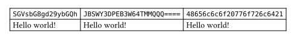

# base64
A package for encoding and decoding base64 strings.

## Methods

### `encode` method
Encodes the given data as a base64 string.

```typ
base64.encode(
  string | array | bytes,
  padding: boolean,
  url: boolean,
) -> string
```

#### `data` parameter
The data to encode. Can be a string, an array, or a bytes object.

#### `padding` parameter
Whether the output should be padded with `=` characters. Defaults to `true`.

#### `url` parameter
Whether URL safe characters should be used. Defaults to `false`.

### `decode` method
Decodes the given base64 string into a bytes object.

```typ
base64.decode(string) -> bytes
```

#### `string` parameter
The base64 string to decode.

## Example

```typ
#import "@local/base64:0.1.0"

#table(
  columns: 2,
  
  [*Decoded*],                           [*Encoded*],
  [Hello world!],                        raw(base64.encode("Hello world!")),
  str(base64.decode("SGFsbG8gV2VsdCE")), raw("SGFsbG8gV2VsdCE"),

  [#(1, 2, 3, 4)],                       raw(base64.encode((1, 2, 3, 4))),
  [#array(base64.decode("BAMCAQ"))],     raw("BAMCAQ"),          
)
```


