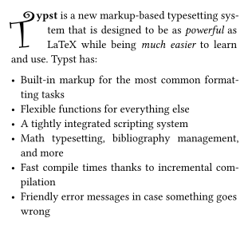

# dropcap
A package for creating dropped capitals in typst.

## Usage
The package comes with a single `dropcap` function that takes content and a few optional parameters. The first letter of the content will be shown as a dropped capital, while the rest of the content will be wrapped around it. The parameters are as follows:

| Parameter        | Description                                              | Default |
|------------------|----------------------------------------------------------|---------|
| `height`         | The height of the dropped capital in lines or as length. | `2`     |
| `justify`        | Whether the text should be justified.                    | `false` |
| `hanging-indent` | The indent of lines after the first.                     | `8pt`   |
| `gutter`         | The space between the first letter and the text.         | `0pt`   |
| `..text-args`    | Arguments to be passed to the text function.             | `(:)`   |

> [!NOTE]
> Show and set rules applied inside the content passed to the `dropcap` function do not work!

## Example
```typ
#import "@local/dropcap:0.1.0": dropcap

#dropcap(
  lines: 3,
  gutter: 4pt,
  hanging-indent: 1em,
  justify: true,
  font: "Curlz MT",
)[
  *Typst* is a new markup-based typesetting system that is designed to be as
  _powerful_ as LaTeX while being _much easier_ to learn and use. Typst has:
  
  - Built-in markup for the most common formatting tasks
  - Flexible functions for everything else
  - A tightly integrated scripting system
  - Math typesetting, bibliography management, and more
  - Fast compile times thanks to incremental compilation
  - Friendly error messages in case something goes wrong
]
```


