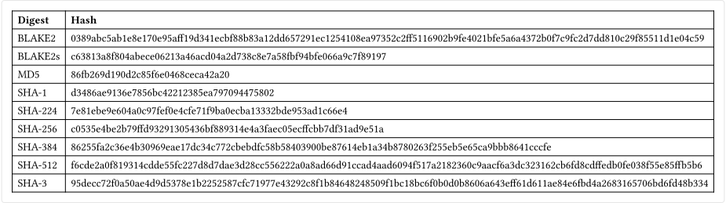

# hash

A package that implements the following hashing algorithms (based on [`RustCrypto`](https://github.com/RustCrypto/hashes)'s crates):

- BLAKE2
- BLAKE2s
- MD5
- SHA-1
- SHA-224
- SHA-256
- SHA-384
- SHA-512
- SHA-3

## Methods

### `hash` method
Hashes the given data using the given algorithm.

```typ
hash.hash(
  string,
  string | array | bytes,
) -> bytes
```

#### `algorithm` parameter
The algorithm to use for hashing. There also exist convenience methods for each algorithm that only take the data to hash.

- `"blake2"`
- `"blake2s"`
- `"md5"`
- `"sha1"`
- `"sha224"`
- `"sha256"`
- `"sha384"`
- `"sha512"`
- `"sha3"`

#### `data` parameter
The data to hash.

### `hex` method
Converts a given bytes object to a hexadecimal string.

```typ
hash.hex(bytes) -> string
```

#### `bytes` parameter
The bytes object to convert.

### `blake2` method
Hashes the given data using the BLAKE2 algorithm.

```typ
hash.blake2(string | array | bytes) -> bytes
```

#### `data` parameter
The data to hash.

### `blake2s` method
Hashes the given data using the BLAKE2s algorithm.

```typ
hash.blake2s(string | array | bytes) -> bytes
```

#### `data` parameter
The data to hash.

### `md5` method
Hashes the given data using the MD5 algorithm.

```typ
hash.md5(string | array | bytes) -> bytes
```

#### `data` parameter
The data to hash.

### `sha1` method
Hashes the given data using the SHA-1 algorithm.

```typ
hash.sha1(string | array | bytes) -> bytes
```

#### `data` parameter
The data to hash.

### `sha224` method
Hashes the given data using the SHA-224 algorithm.

```typ
hash.sha224(string | array | bytes) -> bytes
```

#### `data` parameter
The data to hash.

### `sha256` method
Hashes the given data using the SHA-256 algorithm.

```typ
hash.sha256(string | array | bytes) -> bytes
```

#### `data` parameter
The data to hash.

### `sha384` method
Hashes the given data using the SHA-384 algorithm.

```typ
hash.sha384(string | array | bytes) -> bytes
```

#### `data` parameter
The data to hash.

### `sha512` method
Hashes the given data using the SHA-512 algorithm.

```typ
hash.sha512(string | array | bytes) -> bytes
```

#### `data` parameter
The data to hash.

### `sha3` method
Hashes the given data using the SHA-3 algorithm.

```typ
hash.sha3(string | array | bytes) -> bytes
```

#### `data` parameter
The data to hash.

## Example

```typ
#import "@local/hash:0.1.0": hash, hex, md5, sha256, sha3

#table(
  columns: 2,
  
  [*Algorithm*], [*Hash*],
  [BLAKE2],      hex(hash("blake2", "Hello world!")),
  [BLAKE2s],     hex(hash("blake2s", "Hello world!")),
  [MD5],         hex(md5("Hello world!")),
  [SHA-1],       hex(hash("sha1", "Hello world!")),
  [SHA-224],     hex(hash("sha224", "Hello world!")),
  [SHA-256],     hex(sha256("Hello world!")),
  [SHA-384],     hex(hash("sha384", "Hello world!")),
  [SHA-512],     hex(hash("sha512", "Hello world!")),
  [SHA-3],       hex(sha3("Hello world!")),
)
```


