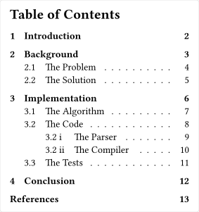

# outex
A package for styling outlines similar to LaTeX.

## Usage
Applying this style is as simple as adding a show rule to your document. The `outex` function comes with a few options that can be used to customize the style of the outline:

| Option | Description | Default |
| --- | --- | --- |
| `gap` | The gap between numbering and section title | `1em` |
| `fill-pad` | The padding around the "fill" line | `(left: 0.5em, right: 1em)` |
| `bold` | Whether the first-level titles should be bold | `true` |
| `space` | Whether to add block-spacing before fist-level titles | `true` |

The package also comes with a custom `repeat` function to allow for easier customization of the fill line. The function allows setting a `gap` and whether to `justify` the items to fill the width. Be careful when importing this function, as it will override the default `repeat` function!

```typ
#import "@local/outex:0.1.0": outex

#set heading(numbering: "1.1 i")

#show heading: set block(below: 1em)
#show: outex

#outline(title: "Table of Contents")

// ...
```


