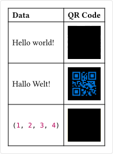

# qr

A package for generating QR codes (based on the Rust crate [`fast_qr`](https://github.com/erwanvivien/fast_qr)).

## Methods

### `create` method
Generates a QR code from the given data.

```typ
qr.create(
  string | array | bytes,

  format: string,
  margin: number,
  fill: color,

  width: auto | relative length,,
  height: auto | relative length,
  alt: none | string,
  fit: string,
) -> image
```

#### `data` parameter
The data to encode into the QR code. If the data is too large to fit into a single QR code, this method will error.

#### `format` parameter
The image format of the QR code.
- `"png"`: Raster image format.
- `"svg"`: Vector image format.

Default: `"svg"`

#### `margin` parameter
The the number of "units" between the QR code and the edge of the image.

Default: `4`

#### `fill` parameter
The color of the QR code.

Default: `black`

#### `width` parameter
The width of the QR code. This parameter is passed to the `image` element.

Default: `auto`

#### `height` parameter
The height of the QR code. This parameter is passed to the `image` element.

Default: `auto`

#### `alt` parameter
The alternative text of the QR code. This parameter is passed to the `image` element.

Default: `none`

#### `fit` parameter
How the QR code should adjust its size to fit a given area. This parameter is passed to the `image` element.
- `"cover"`: The QR code shuold completely cover the area. This is the default.
- `"contain"`: The QR code should be fully contained in the area.
- `"stretch"`: The QR code should be stretched so that it fills the area, even if this means that the image will be distorted.

Default: `"cover"`

## Example

```typ
#import "@local/qr:0.1.0"

#table(
  columns: 2,
  
  [*Data*],        [*QR code*],
  [Hello world!],  qr.create("Hello world!", margin: 0),
  [Hallo Welt!],   qr.create("Hallo Welt!", fill: blue, margin: 2),
  [#(1, 2, 3, 4)], box(fill: yellow, qr.create((1, 2, 3, 4))),
)
```


