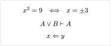

# quick-maths
A package for creating custom shorthands for math equations.

> [!WARNING]
> This repository has been archived. The package has been moved to the [EpicEricEE/typst-quick-maths](https://github.com/EpicEricEE/typst-quick-maths) repository.

## Usage
The package comes with a single template function `shorthands` that takes one or more tuples of the form `(shorthand, replacement)`, where `shorthand` can be a string or content.

```typ
#import "@preview/quick-maths:0.1.0": shorthands

#show: shorthands.with(
  ($+-$, $plus.minus$),
  ($|-$, math.tack),
  ($<=$, math.arrow.l.double) // Replaces '≤'
)

$ x^2 = 9 quad <==> quad x = +-3 $
$ A or B |- A $
$ x <= y $
```


