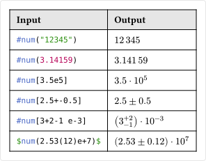

# united
A package for easy typesetting of numbers with units.

This fork of the [unify](https://github.com/ChHecker/unify) package, which was inspired by the [siunitx](https://ctan.org/pkg/siunitx) package for LaTeX, aims to further enhance the functionality and usability of the original package.

## Usage
The package comes with five functions: `num`, `qty`, `unit`, `numrange`, and `qtyrange`, which resemble the equally called LaTeX commands:

| Function   | Description                              | Basic Example            |
|------------|------------------------------------------|--------------------------|
| `num`      | Typesets an integer or decimal number.   | `#num[3.14159]`          |
| `qty`      | Typesets a number with a unit.           | `#qty[42][meter]`        |
| `unit`     | Typesets a unit.                         | `#unit[m/s^2]`           |
| `numrange` | Typesets a range of numbers.             | `#numrange[1][5]`        |
| `qtyrange` | Typesets a range of numbers with a unit. | `#qtyrange[2][4][second]`|

The parameters can be passed either as strings or as content in markup or math mode. Basic numbers can also be passed as `float`s or `int`s.

### Numbers
A number consists of a main value, and can be accompanied by an uncertainty and an exponent. The uncertainty can be typed in different ways, which the following examples show:



### Units
Units can be passed either as words or as shorthand symbols. A single unit consists of an optional prefix, the base unit, and an optional postfix (exponent). Custom units can be typed by wrapping them in single quotes. The following examples show the different ways of typing units:


### Quantities
A quantity is a number accompanied by a unit. The same rules apply as for numbers and units separately. The following examples show how to pass quantities:


### Ranges
The `range` functions work similarly to the `num` and `qty` functions, but take an additional number as the second argument. The following examples show how to pass ranges:

  

### Styling
Every function has a multitude of optional parameters intended for customizing the style of the output. Functions that combine numbers and units (`qty`, `qtyrange`) have parameters for both numbers and units.

For ease of use, the package comes with a convenience function, that allows setting the same parameters for all functions at once. The following example shows how to set the decimal separator to a comma:

```typ
#import "@preview/united:0.1.0"
#let (num, qty) = united.with(decimal-sep: ",")

$ pi approx num(3.14159) $
```

The parameters are given as strings. They are later evaluated in math mode, so quotes and other symbols have to be escaped.

#### Numbers

| Parameter     | Description                                | Default Value  |
|---------------|--------------------------------------------|----------------|
| `decimal-sep` | The decimal separator.                     | `"."`          |
| `group-sep`   | The separator between digit groups.        | `"thin"`       |
| `product`     | The symbol to use for the exponent product | `"dot"`        |

#### Units

| Parameter     | Description                                | Default Value  |
|---------------|--------------------------------------------|----------------|
| `unit-sep`    | The separator between units.               | `"thin"`       |
| `per`         | How to format inverted units.              | `"reciprocal"` |

The `per` parameter allows the following values:

| Value          | Description                                                         |
|----------------|---------------------------------------------------------------------|
| `"reciprocal"` | Show unit as a product, inverted units have negative exponents.     |
| `"fraction"`   | Show unit as a fraction.                                            |
| `"{symbol}"`   | Show unit as an inline fraction with the given symbol as delimiter. |

Keep in mind that the symbol is evaluated in math mode, so quotes, slashes and other symbols have to be escaped by a backslash.

#### Ranges

| Parameter     | Description                                | Default Value  |
|---------------|--------------------------------------------|----------------|
| `delim`       | The delimiter between the numbers.         | `"\"to\""`     |
| `delim-space` | The space between number and delimiter.    | `""`           |
